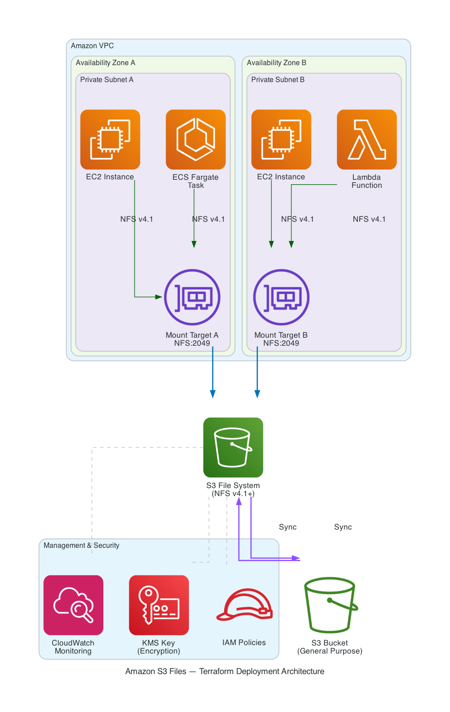

# Deploy Amazon S3 Files with Terraform: Infrastructure as Code for the New S3 File System

Infrastructure as code (IaC) enables teams to manage cloud resources through version-controlled configuration files, bringing consistency, repeatability, and auditability to deployments. When deploying shared file system infrastructure — where a misconfigured security group or missing IAM permission can block an entire application fleet — IaC eliminates configuration drift and makes peer review part of every change.

[Amazon S3 Files](https://aws.amazon.com/s3/files/), launched on April 7, 2026, makes Amazon Simple Storage Service (Amazon S3) buckets accessible as NFS file systems from any AWS compute resource. The [launch blog post](https://aws.amazon.com/blogs/aws/amazon-s3-files/) covers setup through the AWS Management Console and AWS CLI. In this post, we show you how to deploy a production-ready S3 Files infrastructure using [Terraform](https://developer.hashicorp.com/terraform), including multi-AZ mount targets, network isolation, IAM policies, encryption, and monitoring.

You will learn how to:

- Create an S3 file system with configurable encryption (SSE-S3 or customer-managed AWS Key Management Service (AWS KMS) key)
- Deploy mount targets across multiple Availability Zones for high availability
- Configure security groups and IAM policies for least-privilege access
- Mount the file system on Amazon Elastic Compute Cloud (Amazon EC2), Amazon Elastic Container Service (Amazon ECS), and AWS Lambda
- Set up Amazon CloudWatch monitoring for synchronization health

## Solution overview

The following diagram shows the architecture we deploy in this walkthrough. An S3 general purpose bucket is exposed as an NFS file system through S3 Files. Mount targets in private subnets across two Availability Zones serve NFS traffic to compute resources. Security groups restrict access to TCP port 2049 (NFS) between compute and mount targets, and IAM policies enforce least-privilege access at both the resource and identity levels.



*Figure 1: Architecture diagram of S3 Files deployment with multi-AZ mount targets*

The deployment consists of the following components:

- **Amazon S3 bucket** – An existing general purpose bucket containing your data
- **S3 file system** – The NFS layer that exposes bucket contents as a POSIX file system
- **Mount targets** – Elastic network interfaces (ENIs) in your VPC subnets that serve NFS v4.2 traffic on port 2049
- **Security groups** – Controls NFS access between compute resources and mount targets
- **IAM policies** – Resource-based policies on the file system and identity-based policies on compute roles
- **Synchronization** – Bidirectional sync between file system writes and S3 objects
- **Access points** – Optional scoped access to specific directory paths with enforced POSIX identities

## Walkthrough

In this walkthrough, we deploy a complete S3 Files infrastructure using Terraform. The walkthrough includes the following steps:

1. Review the module structure
2. Deploy the S3 file system and mount targets
3. Configure network security
4. Configure IAM policies
5. Configure synchronization
6. Mount on Amazon EC2
7. Mount on Amazon ECS (Fargate)
8. Mount on AWS Lambda
9. Configure monitoring
10. Review security implementations

The deployment typically takes 5–6 minutes to complete. Mount targets are the slowest component at approximately 5 minutes due to ENI provisioning in each Availability Zone.

### Prerequisites

Before you begin, you should have the following prerequisites in place:

- An [AWS account](https://aws.amazon.com/premiumsupport/knowledge-center/create-and-activate-aws-account/) with permissions to create S3 Files, VPC, IAM, and KMS resources
- [Terraform](https://developer.hashicorp.com/terraform/install) v1.5.0 or later installed
- [AWS provider for Terraform](https://registry.terraform.io/providers/hashicorp/aws/latest) v6.53.0 or later (includes S3 Files resource support)
- An existing S3 general purpose bucket
- A VPC with private subnets in at least two Availability Zones
- Basic understanding of Terraform modules and HCL syntax

### Step 1: Review the module structure

The Terraform module follows a standard layout that separates concerns across multiple files:

```
modules/s3-files/
├── main.tf          # File system, mount targets, security groups, sync config
├── iam.tf           # IAM policies for EC2, ECS, and Lambda
├── monitoring.tf    # CloudWatch alarms and dashboard
├── variables.tf     # Input variables with validation
└── outputs.tf       # Exported values for consuming modules
```

The module accepts the following key input variables:

- `bucket_arn` – ARN of the existing S3 bucket to expose as a file system
- `role_arn` – IAM role ARN granting S3 Files permission to sync data (must trust `elasticfilesystem.amazonaws.com`)
- `vpc_id` – VPC where mount targets are created
- `subnet_ids` – List of private subnet IDs (one per Availability Zone)
- `compute_security_group_ids` – Security groups of resources that will mount the file system
- `kms_key_arn` – Optional KMS key ARN for encryption (defaults to SSE-S3 if null)
- `access_points` – Map of access points for scoped, per-application access

### Step 2: Deploy the S3 file system and mount targets

The core of the module creates the file system resource, associates it with your bucket, and deploys mount targets in each subnet.

**To create the file system:**

```hcl
resource "aws_s3files_file_system" "this" {
  bucket                = var.bucket_arn
  role_arn              = var.role_arn
  kms_key_id            = var.kms_key_arn
  accept_bucket_warning = true

  tags = {
    Name        = "s3files-${var.environment}"
    Environment = var.environment
  }
}
```

The `role_arn` argument specifies an IAM role that grants the S3 Files service permission to synchronize data between the file system and S3 bucket. This role must trust `elasticfilesystem.amazonaws.com` and have S3 read/write permissions plus EventBridge permissions for change detection (see Step 10). The `kms_key_id` argument optionally enables KMS encryption. When null, the file system uses SSE-S3 encryption by default.

**To create mount targets across Availability Zones:**

```hcl
resource "aws_s3files_mount_target" "this" {
  for_each = toset(var.subnet_ids)

  file_system_id  = aws_s3files_file_system.this.id
  subnet_id       = each.value
  security_groups = [aws_security_group.file_system.id]
}
```

Each mount target receives an IP address in the subnet's CIDR range. Deploying one per Availability Zone provides high availability — if one zone has an issue, compute resources in the other zone continue accessing the file system through their local mount target.

Note: Mount targets must be in private subnets. Placing them in public subnets exposes NFS traffic to the internet.

Note: Mount target creation typically takes 4–5 minutes as ENIs are provisioned in each Availability Zone. This is the longest step in the deployment.

### Step 3: Configure network security

Security groups control which compute resources can reach the mount targets over NFS. We create a dedicated security group for the file system and reference compute security groups by ID rather than CIDR blocks.

```hcl
resource "aws_security_group" "file_system" {
  name_prefix = "s3files-${var.environment}-fs-"
  description = "Security group for S3 Files mount targets"
  vpc_id      = var.vpc_id

  lifecycle {
    create_before_destroy = true
  }
}

resource "aws_vpc_security_group_ingress_rule" "nfs_from_compute" {
  for_each = toset(var.compute_security_group_ids)

  security_group_id            = aws_security_group.file_system.id
  referenced_security_group_id = each.value
  from_port                    = 2049
  to_port                      = 2049
  ip_protocol                  = "tcp"
  description                  = "NFS from compute"
}
```

This configuration provides the following security benefits:

- **Security group references** – Rules remain valid as instances scale up and down, unlike CIDR-based rules that require updates
- **Dedicated file system security group** – Separates mount target access control from compute security policies
- **Port restriction** – Only TCP 2049 (NFS) is allowed, no other protocols or ports

Note: Your compute resources also need an egress rule allowing TCP 2049 to the file system security group. Without it, the mount command will time out.

### Step 4: Configure IAM policies

S3 Files supports both resource-based policies (on the file system) and identity-based policies (on compute roles). We implement both for defense-in-depth.

**Resource-based file system policy:**

```hcl
resource "aws_s3files_file_system_policy" "this" {
  file_system_id = aws_s3files_file_system.this.id

  policy = jsonencode({
    Version = "2012-10-17"
    Statement = [
      {
        Sid       = "AllowMountFromPrincipals"
        Effect    = "Allow"
        Principal = { AWS = var.allowed_principal_arns }
        Action    = [
          "s3files:ClientMount",
          "s3files:ClientWrite",
          "s3files:ClientRootAccess"
        ]
        Resource  = aws_s3files_file_system.this.arn
        Condition = {
          Bool = { "aws:SecureTransport" = "true" }
        }
      },
      {
        Sid       = "DenyInsecureTransport"
        Effect    = "Deny"
        Principal = "*"
        Action    = "*"
        Resource  = aws_s3files_file_system.this.arn
        Condition = {
          Bool = { "aws:SecureTransport" = "false" }
        }
      }
    ]
  })
}
```

This policy enforces two security controls:

- Only specified IAM principals can mount the file system
- All connections must use TLS (insecure transport is explicitly denied)

**Identity-based policy for compute roles:**

```hcl
data "aws_iam_policy_document" "ec2_s3files" {
  statement {
    sid = "S3FilesMount"
    actions = [
      "s3files:ClientMount",
      "s3files:ClientWrite",
      "s3files:DescribeFileSystems",
      "s3files:DescribeMountTargets",
    ]
    resources = [aws_s3files_file_system.this.arn]
  }
}
```

The module exports separate IAM policies for EC2, ECS, and Lambda, each scoped to the specific file system ARN with only the permissions that compute type requires.

### Step 5: Configure synchronization

Synchronization in S3 Files is automatic by default. When you create a file system linked to a bucket, S3 Files handles bidirectional sync without additional Terraform configuration:

- **File system to S3** – Files written through the NFS mount are synchronized back to S3 as new object versions
- **S3 to file system** – Actively used data is copied to the file system on demand for low-latency NFS access. Objects uploaded directly to S3 (via API, CLI, or console) become available through the file system automatically.

You can customize import rules and data expiration through the synchronization configuration API or the AWS Management Console. In Terraform, the `enable_sync_to_s3` and `enable_sync_from_s3` variables are reserved for future provider support of the `synchronization_configuration` resource block.

Note: Synchronization is eventually consistent. For writes through the NFS mount, allow several minutes for objects to appear in S3. For direct S3 uploads, files become available through the mount point as they are accessed.

### Step 6: Mount on Amazon EC2

To mount the file system on EC2 instances, use a user data script that installs NFS utilities and configures a persistent mount.

**User data template (`templates/user-data.sh.tftpl`):**

```bash
#!/bin/bash
set -euo pipefail

dnf install -y amazon-efs-utils nfs-utils
mkdir -p ${mount_point}

# Mount using the mount helper (recommended — handles TLS, IAM, NFS v4.2)
mount -t efs -o tls,iam ${file_system_id}:/ ${mount_point}

# Persist across reboots
echo "${file_system_id}:/ ${mount_point} efs _netdev,tls,iam 0 0" >> /etc/fstab
```

**Terraform resource referencing the template:**

```hcl
resource "aws_instance" "app" {
  ami                    = data.aws_ami.amazon_linux.id
  instance_type          = "t3.medium"
  iam_instance_profile   = aws_iam_instance_profile.ec2_s3files.name
  subnet_id              = var.private_subnet_ids[0]
  vpc_security_group_ids = [aws_security_group.compute.id]

  user_data = base64encode(templatefile("${path.module}/templates/user-data.sh.tftpl", {
    file_system_id = module.s3_files.file_system_id
    mount_point    = "/mnt/s3files"
  }))
}
```

**Verify the deployment:**

```bash
ssh ec2-user@<instance-ip>
df -h /mnt/s3files
echo "Hello from EC2" > /mnt/s3files/test.txt
```

After a few minutes, verify the file appears in your S3 bucket:

```bash
aws s3 ls s3://my-app-data-dev/test.txt
```

### Step 7: Mount on Amazon ECS (Fargate)

S3 Files integrates with ECS through the `s3filesVolumeConfiguration` parameter in the task definition. Transit encryption is always enabled and cannot be disabled. Use access points for per-task isolation.

```hcl
resource "aws_ecs_task_definition" "app" {
  family                   = "s3files-app"
  requires_compatibilities = ["FARGATE"]
  network_mode             = "awsvpc"
  cpu                      = 512
  memory                   = 1024
  task_role_arn            = aws_iam_role.ecs_task.arn

  volume {
    name = "s3files-data"

    s3files_volume_configuration {
      file_system_arn        = module.s3_files.file_system_arn
      root_directory         = "/"
      transit_encryption_port = 2999
      access_point_arn       = module.s3_files.access_point_arns["app"]
    }
  }

  container_definitions = jsonencode([{
    name  = "app"
    image = "my-app:latest"
    mountPoints = [{
      sourceVolume  = "s3files-data"
      containerPath = "/data"
      readOnly      = false
    }]
  }])
}
```

This configuration provides:

- **Transit encryption** – Always enabled for S3 Files (cannot be disabled)
- **IAM authorization** – The task role must have explicit `s3files:ClientMount` permission
- **Access point scoping** – The container sees only the `/app-data` directory, isolated from other paths
- **Shared storage** – Multiple tasks mounting the same file system can share files across the fleet

Note: Fargate platform version 1.4.0 or later is required for EFS volume support. Set `platform_version = "1.4.0"` in your `aws_ecs_service` resource.

### Step 8: Mount on AWS Lambda

Lambda functions access S3 Files through access points when deployed in the same VPC as the mount targets.

```hcl
resource "aws_lambda_function" "processor" {
  function_name = "s3files-processor"
  role          = aws_iam_role.lambda_s3files.arn
  handler       = "index.handler"
  runtime       = "python3.12"
  timeout       = 120
  memory_size   = 512

  vpc_config {
    subnet_ids         = var.private_subnet_ids
    security_group_ids = [aws_security_group.compute.id]
  }

  file_system_config {
    arn              = module.s3_files.access_point_arns["app"]
    local_mount_path = "/mnt/s3data"
  }
}
```

The Lambda function configuration requires:

- **VPC attachment** – The function must be in the same VPC as the mount targets
- **Access point ARN** – Points to a specific access point (not the file system directly)
- **Local mount path** – Must start with `/mnt/`
- **Adequate timeout** – VPC-attached Lambda functions have longer cold starts (1–5 seconds); set timeout to at least 60 seconds

Note: Consider using [provisioned concurrency](https://docs.aws.amazon.com/lambda/latest/dg/provisioned-concurrency.html) for latency-sensitive workloads to eliminate cold start variability.

### Step 9: Configure monitoring

The module deploys CloudWatch alarms to detect connectivity issues. S3 Files client metrics are emitted by `amazon-efs-utils` to the `efs-utils/S3Files` namespace. These are client-side health checks (value 1 = healthy, 0 = unhealthy):

```hcl
resource "aws_cloudwatch_metric_alarm" "nfs_connection" {
  alarm_name          = "s3files-${var.environment}-nfs-unreachable"
  alarm_description   = "S3 Files NFS mount target is not accessible from client"
  comparison_operator = "LessThanThreshold"
  evaluation_periods  = 3
  metric_name         = "NFSConnectionAccessible"
  namespace           = "efs-utils/S3Files"
  period              = 300
  statistic           = "Minimum"
  threshold           = 1
  treat_missing_data  = "breaching"

  dimensions = {
    FileSystemId = aws_s3files_file_system.this.id
  }
}
```

The module configures alarms for:

- **NFS connection** – Alerts when the client cannot reach the mount target
- **S3 bucket accessible** – Alerts when the client lacks permissions to read the linked bucket
- **S3 bucket reachable** – Alerts when the linked bucket or prefix is not reachable

Note: These metrics require `amazon-efs-utils` to be installed on compute instances. They are emitted per-client, not per-file-system.

A CloudWatch dashboard is also created, displaying all three connectivity metrics in a single view.

### Step 10: Review security implementations

Before deploying to production, review the following security best practices implemented in this module:

**KMS encryption:**

1. Customer-managed KMS key with automatic key rotation enabled
2. Key policy grants `s3files.amazonaws.com` service principal access via `kms:ViaService` condition
3. Deletion window set to 30 days to prevent accidental key loss
4. Compute IAM policies include `kms:Decrypt` and `kms:GenerateDataKey` scoped to the specific key ARN

```hcl
resource "aws_kms_key" "s3files" {
  description             = "KMS key for S3 Files encryption"
  deletion_window_in_days = 30
  enable_key_rotation     = true
}
```

Note: The KMS key policy must explicitly grant the S3 Files service principal access. Without this, mount operations fail with a `kms:Decrypt` authorization error even if the compute role has KMS permissions.

**Network isolation:**

1. Mount targets deployed only in private subnets
2. Security groups reference compute groups by ID (not CIDR)
3. Only TCP port 2049 is allowed (NFS)
4. Egress from file system security group restricted to VPC CIDR

**IAM least privilege:**

1. File system policy enforces TLS for all connections
2. Identity-based policies scoped to the specific file system ARN
3. Separate policies per compute type (EC2, ECS, Lambda)
4. Lambda policies include only the minimal VPC networking permissions (`ec2:CreateNetworkInterface`, `ec2:DescribeNetworkInterfaces`, `ec2:DeleteNetworkInterface`)

## Environment separation

For production deployments, use directory-based environment separation to maintain distinct configurations:

| Configuration | Dev | Prod |
|---|---|---|
| Encryption | SSE-S3 | Customer-managed KMS |
| Mount targets | 2 Availability Zones | 3 Availability Zones |
| File system policy | Permissive | Least-privilege with explicit principals |
| State backend | S3 | S3 with DynamoDB locking |
| Access points | 1 (application) | Multiple (application, analytics, ML) |

```hcl
# Production module invocation
module "s3_files" {
  source = "../../modules/s3-files"

  environment = "prod"
  bucket_arn  = aws_s3_bucket.data.arn
  role_arn    = aws_iam_role.s3files_service.arn
  vpc_id      = var.vpc_id
  subnet_ids  = var.private_subnet_ids

  compute_security_group_ids = [
    aws_security_group.app_servers.id,
    aws_security_group.ecs_tasks.id,
  ]

  kms_key_arn            = aws_kms_key.s3files.arn
  allowed_principal_arns = [
    aws_iam_role.ecs_task.arn,
    aws_iam_role.lambda_s3files.arn,
  ]

  access_points = {
    app       = { path = "/app-data", posix_user = { uid = 1000, gid = 1000 } }
    analytics = { path = "/analytics", posix_user = { uid = 2000, gid = 2000 } }
  }
}
```

## Troubleshooting

The following table lists common issues you might encounter and their resolutions:

| Issue | Cause | Resolution |
|---|---|---|
| Mount command times out | Security group missing TCP 2049 ingress or egress rule | Verify both the file system SG (ingress) and compute SG (egress) allow port 2049 |
| Mount succeeds but I/O hangs | Mount target in a different Availability Zone than compute | Deploy compute in a subnet that has a mount target |
| Files don't appear in S3 | Sync is eventually consistent | Allow several minutes for NFS writes to appear as S3 objects |
| Permission denied on file operations | UID/GID mismatch | Use access points to enforce consistent POSIX identities |
| KMS authorization error | Key policy missing S3 Files service principal | Add `s3files.amazonaws.com` with `kms:ViaService` condition |
| ECS task fails to start | Fargate platform version too old | Set `platform_version = "1.4.0"` or later |
| Lambda timeout on cold start | VPC attachment adds ENI creation latency | Increase timeout to 120s; use provisioned concurrency |
| `terraform destroy` fails with `BucketHasS3FileSystemAttached` | File system detachment is asynchronous | Wait 30 seconds and retry, or add `depends_on` between file system and bucket resources |
| Mount targets take 5+ minutes to create | Normal — ENI provisioning in each Availability Zone | No action needed; wait for completion |
| `role_arn` error on file system creation | Missing IAM role for S3 Files service | Create role trusting `elasticfilesystem.amazonaws.com` with S3 and EventBridge permissions (see Step 10) |

## Cleaning up

To avoid ongoing charges, destroy the infrastructure when you're done testing.

First, unmount the file system from any running compute resources:

```bash
sudo umount /mnt/s3files
```

Then destroy the Terraform resources:

```bash
terraform destroy
```

Enter `yes` when prompted to confirm.

Note: Destroying the file system does not delete objects in the S3 bucket. Your data remains safely in S3 and you can recreate the file system later to access the same data through NFS again.

## Conclusion

In this post, we showed you how to deploy Amazon S3 Files using Terraform with production security controls. The module handles the complete infrastructure — file system creation, multi-AZ mount targets, security groups, IAM policies, KMS encryption, synchronization configuration, and CloudWatch monitoring — in a repeatable, version-controlled configuration.

To customize this solution for your environment, you can modify the module variables to adjust encryption settings, add access points for additional teams, or integrate the module outputs with your existing compute infrastructure. For workloads requiring specific synchronization behavior, adjust the `sync_to_s3` and `sync_from_s3` settings based on your consistency requirements.

For more information, see the following resources:

- [Amazon S3 Files documentation](https://docs.aws.amazon.com/AmazonS3/latest/userguide/s3-files.html)
- [Terraform AWS provider documentation](https://registry.terraform.io/providers/hashicorp/aws/latest/docs)
- [AWS KMS best practices](https://docs.aws.amazon.com/prescriptive-guidance/latest/aws-kms-best-practices/introduction.html)
- [Amazon VPC security best practices](https://docs.aws.amazon.com/vpc/latest/userguide/vpc-security-best-practices.html)

---

## About the authors

**Author Name** is a [role] at Amazon Web Services. [Bio sentence about expertise and interests.]
